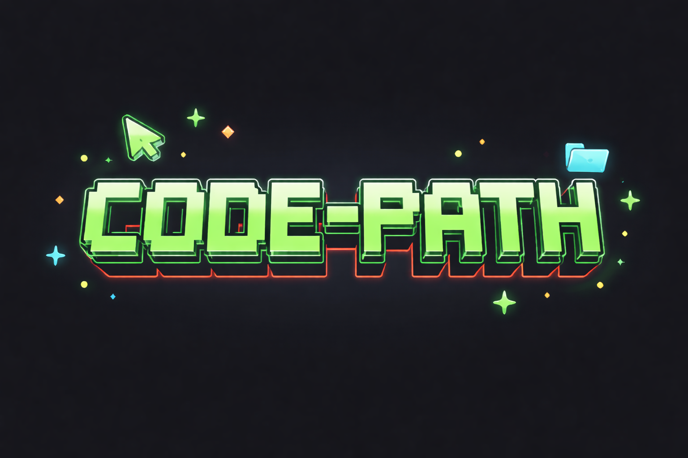

Code Path es un espacio para repasar y aprender programación.
Aquí voy guardando mis apuntes, ejercicios y recursos, tanto para
tenerlos organizados como para compartirlos por si a alguien más le
resultan útiles. La idea es ir construyendo poco a poco un camino de
aprendizaje.

<h2>📑 Contenido</h2>

- [Código](#código)
- [Ejercicios](#ejercicios)

---

> [!IMPORTANT]
> Este repositorio forma parte de la web [code-path](), pensada para reforzar las partes de código.

> [!WARNING]
>
> El proyecto **está en desarrollo**, por lo que puede que encuentres enlaces vacíos o secciones aún en construcción, pensadas como guía para el futuro.

 

## Código

- [Sistemas]()
- [Gestión de datos]()
- [Web]()
<!-- - [Java]() -->

## Ejercicios
