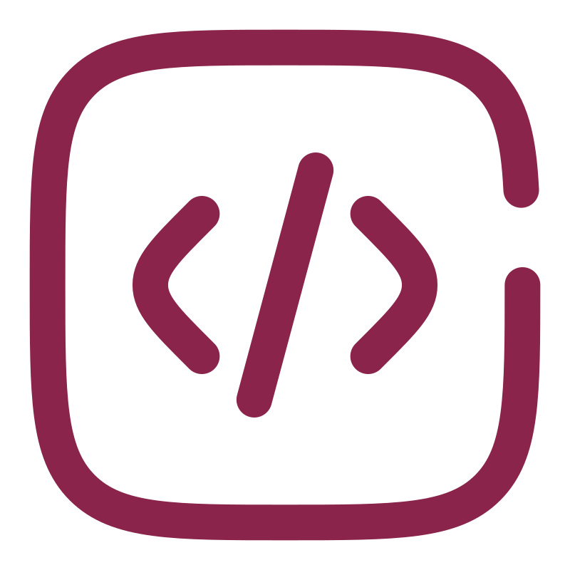

<h1>
  
  {Code-Path}
  
</h1>

Este repositorio forma parte del proyecto [Bóveda-IT](https://github.com/u-n-a-i/boveda-it). Mientras el otro proyecto documenta los fundamentos, arquitecturas y marcos conceptuales, aquí encontrarás el **código, configuraciones y laboratorios** para llevar esa teoría a entornos reales.

<h2>📑 Contenido</h2>

<!-- - [Entorno de desarrollo](#entorno-de-desarrollo)
  - [Linux](#linux)
  - [Git \& GitHub](#git--github)
  - [Docker](#docker) -->

- [Lenguajes declarativos](#lenguajes-declarativos)
  - [HTML](#html)
  - [CSS](#css)
  - [SQL {PostgreSQL}](#sql-postgresql)
- [Ecosistema JavaScript](#ecosistema-javascript)
  - [JavaScript](#javascript)
  - [TypeScript](#typescript)
  - [Jest](#jest)
  - [Node.js](#nodejs)
  - [Angular](#angular)

---

> [!WARNING]
>
> El proyecto **está en desarrollo**, por lo que puede que encuentres enlaces vacíos o secciones aún en construcción, pensadas como guía para el futuro.

 

<!-- ## Entorno de desarrollo

### Linux

### Git & GitHub

### Docker

--- -->

## Lenguajes declarativos

### HTML

### CSS

### SQL {PostgreSQL}

---

## Ecosistema JavaScript

### JavaScript

### TypeScript

### Jest

### Node.js

### Angular

---
